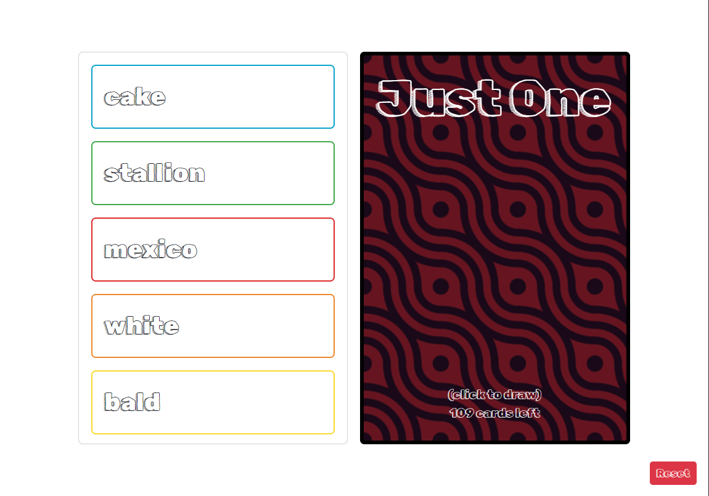

# JustOne

> [!IMPORTANT]
> Buy the game [here](https://www.rprod.com/en/games/just-one)

>To save the last minute new year's eve party, I decided to create a web app that allows us to play the game **Just One**.

This is a game where one of the players have to guess a word the other players give one word clues about.

The player who guesses the word says a number between 1 and 5, and the other players write down a word that they think will help the player guess the word.

If two or more players write the same word, the word is removed from the list of clues.

## Preview

## Support
